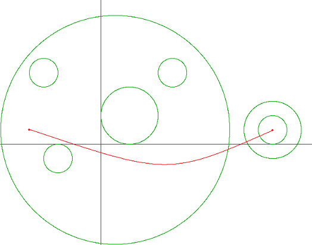
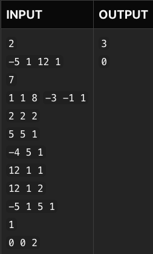

## The Little Prince

 - The Little Prince, who lives on asteroid B-664, loves Rose. One day, the little prince, learning that Rose was in danger, began a long journey through the Milky Way to save Rose. However, the little prince's spaceship is not that good, so Little Price has to avoid planetary systems (gravitational fields) as much as possible on his way. The picture below is a part of the Milky Way map traveled by the little prince.



 The **red solid line** is the path that minimizes the number of *entry/exit* into ***planetary systems*** required for the little prince to travel from starting point to the end point. The circles represent the boundary of the planetary system. There are multiple path to go from start to end points, but at least 3 *entry/exit* of the planetary system is required.

Given the milky way map with coordinates of planetary systems, **starting & destination points** of Little Prince, let's write a program that finds the path with minimum *enter/exits* into planetary systems.

> Assume that the boundary of planetary systems do not intersect with each other. In addition, assume that starting & destination points are not on the boundary of planetary systems.

## Inputs

* First line, number of test cases M.
* From the next line, for each test case:
    * In the first line, a starting point (x1 , y1) and a destination point (x2 , y2) are given.
    * In the second line, N is the number of planetary systems
    * From the third line, there are N lines with (cx, cy, r), center point and radius for each planet. The input constraints are as follows. ```(-1000 ≤ x1, y1 ,x2 ,y2 , cx, cy ≤ 1000, 1 ≤ r ≤ 1000, 1 ≤ N ≤ 50)```

> All inputs are ```integers.```

### For each test case, print the minimum number of times the little prince must enter/exit the planetary system.



